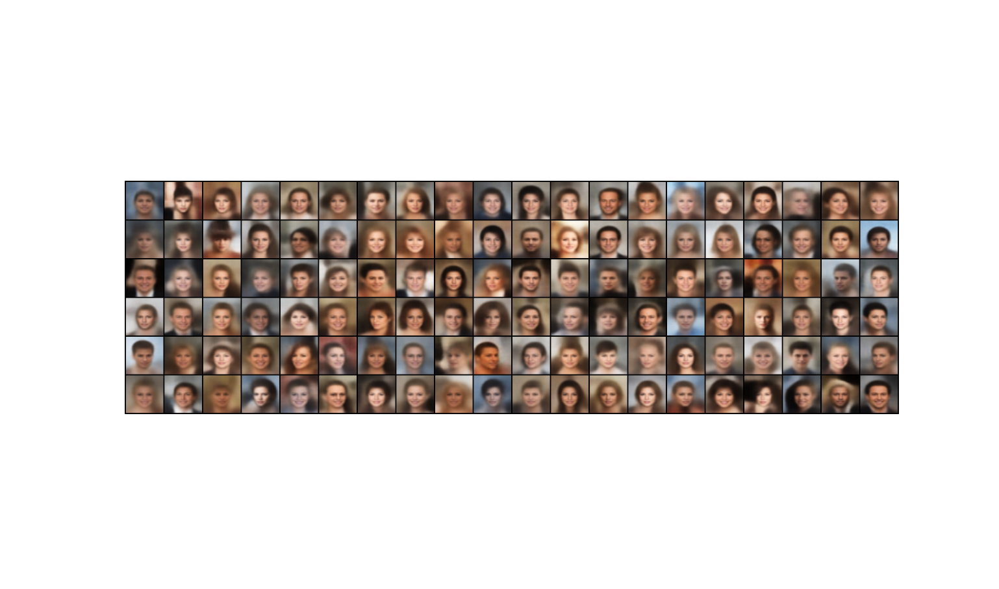
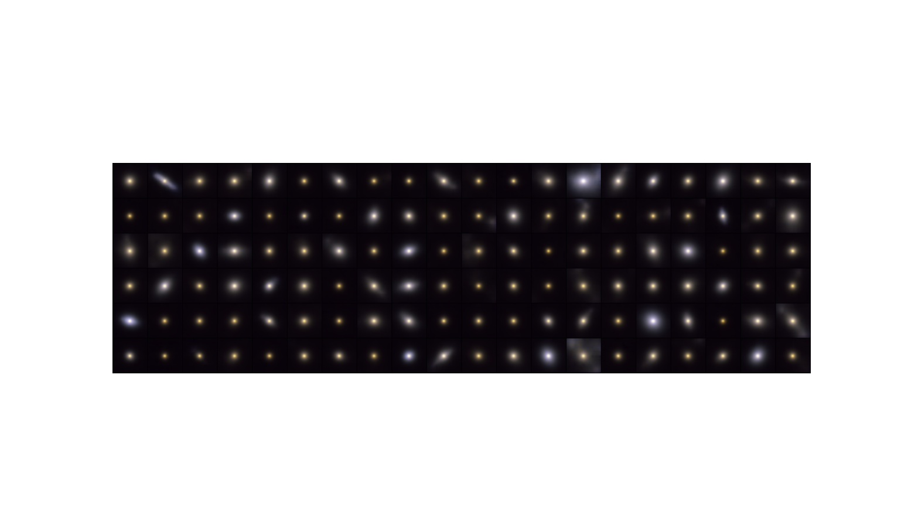

VAE Project

This repository contains a Variational Autoencoder (VAE) model, trained on both the CelebA dataset and KiDS galaxies. The project is designed for easy customization and training of the model.

## Project Overview

In this project, I developed a straightforward VAE model, available in `model.py`. You can train the model using the provided `train.py` script, with configurations specified in the `config.yaml` file.

## Training the Model

To train the model, run the following command:

```bash
python train.py --config <config_path>
```  

Replace <config_path> with the path to your config.yaml file. This configuration file contains all the necessary details for initializing the model, setting training parameters, and configuring logging.

## Sampling from CelebA



## Sampling from KiDS galaxies 


